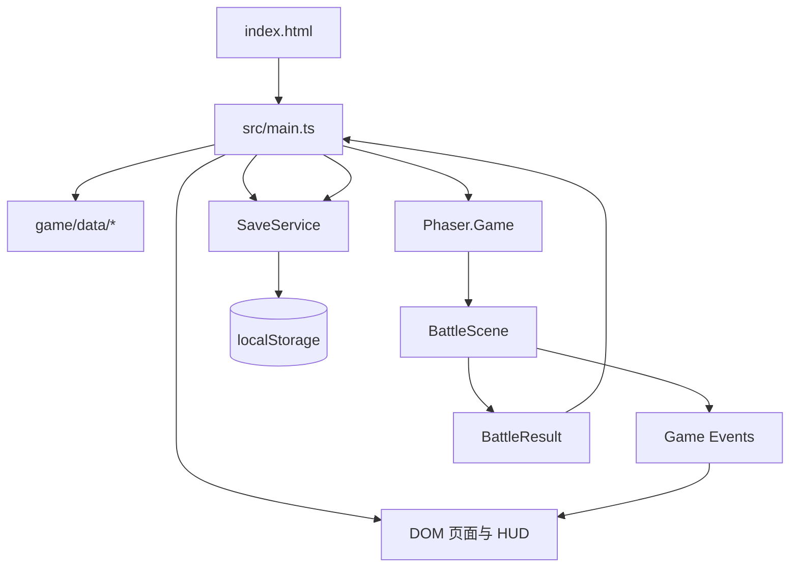

# 零界回声：天穹余烬

原创 2D 纵版科幻飞行射击 H5。玩家驾驶代号“回声”的战机穿越天穹协议封锁，在 22 个关卡中回收被删除的战争记录，并逐步揭开欧米伽重启的真相。

- 在线体验：<https://jrainlau.github.io/thunder/>
- 源码仓库：<https://github.com/jrainlau/thunder>
- 游戏设计摘要：[`docs/GDD.md`](docs/GDD.md)

## 项目概览

当前版本是一套可直接运行和部署的纯前端单机游戏原型，已包含：

- 10 架定位不同的战机，每架拥有 Lv.1–Lv.3 三个成长阶段。
- 火力、射速、机动、装甲、能量、幸运六维属性体系。
- 6 类主武器，每类可强化至 W3，并覆盖连射、穿透、追踪、范围和蓄力等攻击形态。
- 10 个专属大招，以及按战机 ID 和等级生效的专属被动。
- 20 个常规关卡、2 个隐藏关卡、22 组独立 BOSS 设定。
- 四幕主线、两章隐藏剧情、人物档案、武器图鉴和 BOSS 档案。
- 评级、首通奖励、战术数据、机体升级、条件解锁和本地存档。
- 键盘、鼠标和触屏输入，以及桌面端和移动端自适应布局。
- GitHub Actions 自动检查、构建并部署到 GitHub Pages。

游戏不依赖后端服务，也没有外部美术资源。战机、敌机、BOSS、弹幕和战斗背景由 Phaser Graphics 在运行时程序化生成；菜单、机库、星图和档案界面由原生 DOM 与 CSS 渲染。

## 快速开始

### 环境要求

- Node.js `20.19+`，或 `22.12+`
- npm（使用仓库内的 `package-lock.json`）
- 支持 ES2022、Canvas 和 WebGL 的现代浏览器

CI 使用 Node.js 20。为确保依赖版本与线上一致，首次安装和自动化环境优先使用 `npm ci`。

```bash
npm ci
npm run dev
```

开发服务器默认启动在 <http://127.0.0.1:4173>。端口固定为 `4173`，被占用时 Vite 会直接报错，不会自动切换端口。

### 常用命令

| 命令 | 用途 |
| --- | --- |
| `npm run dev` | 启动本地 Vite 开发服务器 |
| `npm run lint` | 执行 TypeScript 严格类型检查；当前没有单独配置 ESLint |
| `npm test` | 使用 Vitest 一次性运行全部测试 |
| `npm run build` | 先执行 `tsc -b`，再生成生产包到 `dist/` |
| `npm run preview` | 本地预览已经构建的 `dist/` |

推荐提交前依次执行：

```bash
npm run lint
npm test
npm run build
```

## 游戏操作

| 操作 | 键盘 | 鼠标 / 触屏 |
| --- | --- | --- |
| 移动 | `WASD` 或方向键 | 在战斗区域按住并拖动 |
| 装配待选武器 | `E`，也兼容空格 | 点击“装配”提示 |
| 释放专属大招 | `X`，也兼容 `Shift` | 点击右下角大招按钮 |
| 暂停 / 恢复 | `Esc` | 点击右上角暂停按钮 |

主武器自动射击。拾取同类武器或火力芯片会提升当前武器等级；拾取不同武器后会出现 5 秒装配窗口。击破敌人和擦弹可积累大招能量。

## 核心玩法循环

```text
选择与升级战机
  → 查看关卡、BOSS 和环境情报
  → 战斗中移动、擦弹、切换并强化武器
  → 击败独立 BOSS
  → 结算评级、战术数据、星币和档案
  → 解锁后续关卡、战机与隐藏剧情
```

- 常规关卡按顺序解锁，推荐等级只表示难度，不是硬门槛。
- 战机升级消耗战术数据：Lv.1 → Lv.2 需要 120，Lv.2 → Lv.3 需要 300。
- 战斗失败仍保留按 35% 系数计算的本局战术数据。
- 首次胜利额外获得 25 战术数据；重复通关不会再次获得首通奖励。
- 评级综合最终得分、通关时间、当前机体功率和关卡威胁值计算。
- H1 需要收集第 7、12、17 关黑匣子，并至少有 3 个关卡达到 A 级。
- H2 需要通关全部 20 个常规关卡和 H1。

## 技术栈

| 层级 | 技术 | 职责 |
| --- | --- | --- |
| 语言 | TypeScript 5，严格模式 | 领域模型、UI 和战斗逻辑 |
| 构建 | Vite 7 | 开发服务器、资源打包、Pages 子路径支持 |
| 战斗引擎 | Phaser 3.90 + Arcade Physics | 游戏循环、对象池、输入、碰撞、弹幕和程序化绘制 |
| 非战斗 UI | 原生 DOM + CSS | 菜单、机库、星图、档案、HUD 外壳和结算页 |
| 测试 | Vitest 3 | 数据完整性、成长解锁和存档安全 |
| 持久化 | `localStorage` | 单机进度、备份和恢复 |
| 部署 | GitHub Actions + GitHub Pages | `main` 分支自动检查、构建和发布 |

项目没有使用 React、Vue、状态管理库、路由库或后端 API。页面状态由 `src/main.ts` 中的模块级状态和渲染函数维护。

## 目录结构

```text
.
├── .github/
│   └── workflows/
│       └── deploy-pages.yml       # main 分支的检查、构建与 Pages 部署
├── docs/
│   └── GDD.md                     # 核心循环、成长规则、内容规模和平衡目标
├── src/
│   ├── main.ts                    # 应用入口、页面状态、DOM UI、Phaser 桥接、结算入库
│   ├── styles.css                 # 全部界面、HUD、响应式布局和动效样式
│   └── game/
│       ├── types.ts               # ID 联合类型和全局领域模型
│       ├── data/
│       │   ├── fighters.ts        # 10 架战机、30 个等级形态、被动和大招元数据
│       │   ├── weapons.ts         # 6 类武器的基础数值和展示元数据
│       │   ├── stages.ts          # 22 关、BOSS、剧情简报和威胁数据
│       │   ├── story.ts           # 序章、人物和五段章节结构
│       │   ├── progression.ts     # 升级、功率、评级、关卡与战机解锁规则
│       │   └── validate.ts        # 内容数量、唯一 ID 和六维预算校验
│       ├── save/
│       │   └── SaveService.ts     # 默认存档、运行时校验、备份和持久化
│       └── scenes/
│           └── BattleScene.ts     # 完整 Phaser 战斗场景
├── tests/
│   ├── data-integrity.spec.ts     # 内容规模、六维预算、武器差异检查
│   ├── progression.spec.ts        # 升级成本、功率区间和解锁规则
│   └── save-validation.spec.ts    # 越界数据、未知 ID 和锁定战机防注入
├── index.html                     # HTML 入口、CSP 和 #app 容器
├── package.json                   # npm 脚本与依赖
├── package-lock.json              # 锁定依赖版本
├── tsconfig.json                  # TypeScript 严格规则
├── vite.config.ts                 # 构建目标、相对 base、开发端口
└── vitest.config.ts               # Node 测试环境和测试文件范围
```

`dist/`、`node_modules/`、预览截图和 TypeScript 构建缓存均被 `.gitignore` 排除，不应手工提交或维护。

## 总体架构



代码按三个边界组织：

1. **内容与规则层**：`src/game/data/` 和 `src/game/types.ts`。保存战机、武器、关卡、剧情、成长公式和解锁条件，不接触 DOM。
2. **战斗运行时**：`src/game/scenes/BattleScene.ts`。负责 Phaser 生命周期、输入、物理对象、对象池、战斗状态和结算结果。
3. **应用外壳**：`src/main.ts` 和 `src/styles.css`。负责屏幕切换、原生 DOM 渲染、机库升级、星图选择、HUD 同步、存档更新和 Phaser 实例销毁。

这种边界让非战斗页面不依赖 Phaser 场景状态，同时让战斗场景只通过启动参数和事件与 DOM 外壳通信。

## 应用启动与页面流转

入口链路如下：

```text
index.html
  → 加载 src/main.ts
  → validateContent() 校验静态配置
  → SaveService 读取并校验主存档或备份
  → 根据存档选择当前战机和下一个可玩关卡
  → render()
  → 默认渲染主菜单
```

`src/main.ts` 使用 `ScreenId` 管理六个页面：

- `menu`：主菜单、当前任务和序章入口。
- `hangar`：战机选择、六维雷达图、被动、大招和升级。
- `map`：章节路线、关卡解锁、BOSS 情报和出击入口。
- `battle`：Phaser Canvas、DOM HUD、剧情字幕和暂停面板。
- `result`：评级、收益、档案和下一任务入口。
- `archive`：章节、人物、武器和 BOSS 图鉴。

页面没有 URL 路由。`setScreen()` 更新模块级 `screen` 后重新写入 `#app`；离开战斗页时必须调用 `destroyBattle()`，否则 Canvas、物理世界和输入监听会残留。

## DOM 与 Phaser 的通信

开始战斗时，`src/main.ts` 创建固定逻辑分辨率为 `720 × 1080` 的 `Phaser.Game`，再显式注册并启动 `BattleScene`：

```text
BattleLaunch
  = stage + fighter + fighterLevel + firstClear
```

场景通过 `game.events` 向 DOM 外壳发送信息：

| 事件 | 载荷 / 用途 |
| --- | --- |
| `battle:hud` | 分数、生命、连击、武器、热量、蓄力、大招和 BOSS 血量 |
| `battle:story` | 战斗简报和无线电剧情 |
| `battle:notice` | 拾取、环境预警和状态提示 |
| `battle:boss` | BOSS 名称、称号和入场台词 |
| `battle:ultimate` | 大招名称和描述 |
| `battle:weapon-swap` | 待装配武器及 5 秒交互提示 |
| `battle:pause` | 控制 DOM 暂停面板显隐 |
| `battle:complete` | 返回完整 `BattleResult`，由外壳负责结算入库 |

DOM 按钮通过 `getBattleScene()` 调用场景的公开方法：

- `activateUltimate()`
- `confirmWeaponSwap()`
- `togglePause()`

不要让 `BattleScene` 直接写页面 DOM，也不要让 DOM 外壳直接修改场景私有状态。新增跨边界能力时，优先沿用“公开命令方法 + 事件快照”的模式。

## 战斗运行时

`BattleScene` 集中实现当前全部战斗系统：

- Phaser 场景生命周期和运行时状态重置。
- `WASD`、方向键、鼠标与触屏拖动输入。
- 玩家弹、敌弹、敌机和掉落物四类 Arcade 对象池。
- 自动射击、武器热量、蓄力、追踪、穿透和近距衰减。
- 小怪波次、精英单位、环境弹幕和 BOSS 三阶段弹幕。
- 碰撞、短暂无敌、擦弹、连击、掉落、分数和大招能量。
- 各战机按 `fighter.id`、等级、武器和战斗状态触发的被动效果。
- 胜负判定、评级输入指标和 `BattleResult` 生成。

### 对象池与运行时元数据

物理对象池必须保留 `classType: Phaser.Physics.Arcade.Image`。场景使用 `WeakMap` 记录弹体、敌人和掉落物的运行时状态，并使用 `WeakSet` 防止：

- 穿透弹在连续物理帧中重复伤害同一目标。
- 同一敌弹在玩家附近连续触发擦弹奖励。

池对象再次启用时，要同步重设纹理、缩放、速度、深度和对应的 WeakMap 状态，不能假定回收对象仍是默认值。

### BOSS 和环境机制的实际组织方式

22 个 BOSS 都有独立名称、称号、颜色、台词和档案，但当前并不是 22 个独立类。战斗表现由关卡 `order` 参数化组合：

- BOSS 在击破 `12 + min(10, 关卡序号)` 个敌人后生成。
- BOSS 根据剩余生命进入三个阶段。
- 六种基础弹幕原语通过关卡序号选择主、副模式，并调整弹数、速度、轨迹和移动方式。
- 五种环境弹幕原语同样根据关卡序号组合，并随进度提高密度。

因此，修改 `stages.ts` 中的 `mechanic` 文案不会自动生成一种全新的环境逻辑。若新增真正独特的关卡机制，需要同步扩展 `updateEnvironment()` / `emitEnvironmentPattern()`；若新增独特 BOSS 行为，需要扩展 `fireBossPattern()` / `emitBossPattern()`。

## 数据模型与扩展点

所有核心 ID 都在 `src/game/types.ts` 中定义为联合类型：

- `FighterId`
- `WeaponId`
- `StageId`
- `FighterLevel`
- `WeaponLevel`
- `Rank`
- `ScreenId`

这能让配置表、存档、战斗和测试共享同一约束。新增或删除内容时不能只改配置数组，必须同步所有依赖该 ID 的分支和校验器。

### 战机

战机配置位于 `src/game/data/fighters.ts`。每架战机包含：

- 基础身份：ID、名称、呼号、定位、颜色和背景设定。
- 两种适配武器，战斗中提供 5% 伤害修正。
- 三个等级定义：六维、功率预算、被动文案和外观形态。
- 一个专属大招：名称、描述、持续时间、BOSS 单次伤害上限和颜色。
- 解锁文案。

等级六维总点数固定为：

| 等级 | 六维总点数 | `powerBudget` |
| --- | ---: | ---: |
| Lv.1 | 36 | 100 |
| Lv.2 | 40 | 112 |
| Lv.3 | 44 | 125 |

被动文案是数据，但实际战斗效果主要在 `BattleScene` 中按战机 ID 实现。调整被动时必须同时检查文案和运行时代码，避免展示与行为不一致。

### 武器

武器基础配置位于 `src/game/data/weapons.ts`，实际射击形态位于 `BattleScene.fireWeapon()`：

| ID | 武器 | 主要实现 |
| --- | --- | --- |
| `pulse` | 脉冲机枪 | 多路高速直射，W3 可穿透 |
| `laser` | 棱镜激光 | 高速穿透，受热量限制 |
| `drone` | 浮游炮群 | 多侧翼发射并自动索敌 |
| `scatter` | 炽流霰炮 | 扇形近距爆发，距离越远伤害越低 |
| `missile` | 蜂群导弹 | 多枚低频追踪弹 |
| `rail` | 轨道蓄能炮 | 满蓄力后发射高伤贯穿弹 |

`weapons.ts` 只定义基础伤害、射击间隔和展示信息。改变攻击形态时还要修改 `fireWeapon()`、投射物更新、特殊命中逻辑和相关测试。

### 关卡与剧情

`src/game/data/stages.ts` 保存每关的静态数据：

- 顺序与章节。
- 名称、地点和环境机制文案。
- BOSS 名称、称号、颜色与台词。
- 推荐等级和自动计算的威胁值。
- 出击简报和通关档案。
- 是否为隐藏关。

威胁值按 `round(100 × 1.08^(order - 1))` 生成。剧情总览、人物和章节结构位于 `story.ts`；关卡内具体叙事则随关卡定义保存。

### 成长、评级与解锁

`src/game/data/progression.ts` 是所有成长规则的单一入口：

- `upgradeCost()`：升级成本。
- `powerScore()`：基于六维估算综合机体功率。
- `rankForScore()`：按得分、时间、功率和关卡威胁计算评级。
- `isStageUnlocked()`：常规关与隐藏关解锁。
- `newlyUnlockedFighters()`：战机条件解锁。

`SaveService.validateSave()` 会独立重算允许解锁的战机，防止直接编辑 `localStorage` 注入锁定机体。修改战机解锁规则时，必须同步 `newlyUnlockedFighters()` 和 `validateSave()`，并更新测试。

## 存档设计

当前存档版本为 `1`，主键为：

```text
zero-boundary-echo.save.v1
```

另有两个内部键：

```text
zero-boundary-echo.save.v1.backup
zero-boundary-echo.save.v1.temp
```

写入流程：

1. 对 `SaveService.snapshot()` 的克隆执行更新函数。
2. 使用 `validateSave()` 校验完整的新存档。
3. 写入临时键并重新读取、解析和校验。
4. 将旧内存存档写入备份键。
5. 将新存档提交到主键并删除临时键。
6. 若浏览器禁用或耗尽本地存储，则保留内存状态并打印警告，不中断游戏。

读取时先尝试主存档，再尝试备份，二者都无效才创建默认存档。运行时校验会处理：

- 非法版本、负资源、非有限数字和越界等级。
- 未知战机、武器和关卡 ID。
- 非法关卡记录和超量档案。
- 未满足真实解锁条件却被写入的战机。
- 指向锁定战机的 `selectedFighter`。

### 修改存档结构时

当前加载器只接受 `version: 1`，没有通用迁移框架。增加必填顶层字段或升级版本时，需要同时完成：

1. 修改 `SaveData` / `StageRecord` 类型。
2. 修改 `createDefaultSave()`。
3. 修改 `validateSave()` 和必要的记录兼容默认值。
4. 增加旧版本到新版本的显式迁移逻辑。
5. 更新 `save-validation.spec.ts`。
6. 验证已有 v1 存档不会被无提示清空。

不要直接信任 `JSON.parse()` 的结果，也不要绕过 `validateSave()` 写入存档。

## 内容校验与测试

应用启动时会立即调用 `validateContent()`。以下静态约束不满足时，页面会在渲染前抛错：

- 必须正好有 10 架战机。
- 必须正好有 6 类武器。
- 必须正好有 22 个关卡和 22 个不同的 BOSS 名称。
- 战机与武器 ID 不得重复或缺失。
- 每架战机三级六维总点数必须分别为 36、40、44。

Vitest 当前运行 3 个测试文件、共 10 个测试：

- `data-integrity.spec.ts`：内容规模、独立 BOSS、战机等级与武器差异。
- `progression.spec.ts`：升级成本、同级功率区间、关卡与战机解锁。
- `save-validation.spec.ts`：存档接受、拒绝、过滤和防注入。

测试运行于 Node 环境，主要覆盖纯数据和规则层。`BattleScene` 和 DOM 页面目前依靠构建检查与浏览器冒烟测试，尚未配置自动化浏览器测试。

## 构建与部署

`vite.config.ts` 使用：

- `base: "./"`：生成相对资源路径，兼容 GitHub Pages 的 `/thunder/` 子路径。
- `target: "es2022"`。
- `sourcemap: true`：生产构建会生成 source map。

`.github/workflows/deploy-pages.yml` 在以下情况触发：

- 向 `main` 分支 push。
- 在 GitHub Actions 页面手动执行 `workflow_dispatch`。

流水线顺序为：

```text
checkout
  → Node.js 20 + npm cache
  → npm ci
  → npm run lint
  → npm test
  → npm run build
  → 上传 dist Pages artifact
  → 部署到 github-pages 环境
```

不要提交 `dist/`。部署产物始终由 CI 从源码重新生成。若修改仓库名或部署到不同子路径，优先确认 `vite.config.ts` 的 `base` 和 Pages 设置。

## 安全与浏览器边界

- `index.html` 配置了 Content Security Policy，只允许同源脚本、资源和 WebSocket 开发连接。
- 存档属于不可信输入，所有字段均通过运行时类型守卫和边界校验。
- DOM 模板中的动态文本应通过 `escapeHtml()` 或 `textContent` 写入；未来若接入用户输入或远程内容，禁止直接拼入 `innerHTML`。
- 当前没有网络请求、登录、账号系统、云存档或服务端权限模型。
- 项目不读取 `.env`，`.env*` 默认被忽略；未来若接入服务，密钥不得进入前端包或提交到仓库。

## 后续 Agent 接手指南

### 建议阅读顺序

1. 阅读本 README 和 `docs/GDD.md`，确认玩法目标与内容规模。
2. 阅读 `src/game/types.ts`，建立领域模型和 ID 约束。
3. 阅读 `src/game/data/`，了解数据来源、平衡公式和解锁条件。
4. 阅读 `src/main.ts`，理解页面状态、Phaser 生命周期和结算入库。
5. 阅读 `BattleScene.ts`，定位实际战斗机制。
6. 阅读 `SaveService.ts` 和 `tests/`，确认兼容与安全边界。
7. 修改后执行类型检查、测试、构建，再进行真实浏览器冒烟验证。

### 常见改动的最小影响面

| 需求 | 优先检查的文件 |
| --- | --- |
| 调整战机数值或展示 | `fighters.ts`、`validate.ts`、`data-integrity.spec.ts` |
| 调整战机被动或大招行为 | `fighters.ts`、`BattleScene.ts` |
| 调整武器数值 | `weapons.ts`、`progression.ts`、相关测试 |
| 改变武器射击形态 | `weapons.ts`、`BattleScene.fireWeapon()`、命中与投射物更新逻辑 |
| 调整关卡/BOSS 文案和基础参数 | `stages.ts` |
| 新增真实环境或 BOSS 机制 | `stages.ts`、`BattleScene.updateEnvironment()`、`fireBossPattern()` |
| 调整评级、升级或解锁 | `progression.ts`、`SaveService.validateSave()`、`progression.spec.ts` |
| 修改结算奖励 | `BattleScene.finishBattle()`、`main.ts.completeBattle()` |
| 修改机库、星图、档案或结算 UI | `main.ts`、`styles.css` |
| 修改存档字段 | `types.ts`、`SaveService.ts`、结算调用方、`save-validation.spec.ts` |
| 修改部署方式 | `vite.config.ts`、`.github/workflows/deploy-pages.yml` |

### 必须留意的实现约束

- TypeScript 开启 `strict`、`noUncheckedIndexedAccess`、`noUnusedLocals`、`noUnusedParameters` 和 `noFallthroughCasesInSwitch`。
- `validateContent()` 固定校验当前产品规模；如果产品目标仍是 10/6/22，不要为了绕过配置错误而放宽校验。
- Phaser 场景应继续通过 `scene.add(..., true, launchData)` 显式启动，不要改成可能错过 `ready` 事件的延迟接线。
- Arcade 对象池需要明确 `classType`，池中取出的对象要用 `instanceof Phaser.Physics.Arcade.Image` 收窄。
- 穿透弹必须保留每弹、每目标命中去重；擦弹也必须每枚敌弹只记一次。
- `Esc` 使用 `window` 级监听，场景 `SHUTDOWN` 时必须移除，避免重开战斗后重复响应。
- 离开战斗页、完成战斗和浏览器卸载时都要销毁 Phaser 实例。
- 首通状态在开战时通过 `BattleLaunch.firstClear` 固化，不能在结算后再依据已经更新的存档判断。
- 战机解锁规则存在两份互相校验的实现：正常进度计算和存档白名单重算，修改时必须保持一致。
- BOSS “独立”目前表示独立设定与参数组合，不代表每个 BOSS 有独立类；需求若升级为独有行为，应明确重构方案。
- `styles.css` 集中管理全站样式并包含移动端断点；局部 UI 变更也要检查桌面和窄屏布局。

### 当前有意保留的边界

后续 Agent 不应误认为下列能力已经完整实现：

- `muted` 已有存档字段和按钮，但当前没有音频资源或音频播放系统。
- `reducedMotion` 存在于存档模型；当前视觉降级主要依赖 CSS 的 `prefers-reduced-motion`，尚无对应设置页。
- `starCoins` 会在结算时累计，但当前没有消费入口。
- 没有云存档、账号、多周目、难度选择、手柄输入或无障碍按键重映射。
- 没有自动化浏览器/E2E 测试；战斗改动必须手工完成一次真实出击验证。

## 验收清单

完成改动后至少确认：

- `npm run lint` 通过。
- `npm test` 的全部测试通过。
- `npm run build` 成功生成 `dist/`。
- 主菜单、机库、星图和档案页可正常切换。
- 能进入战斗，键盘和指针移动、自动射击、拾取和暂停正常。
- 能击败 BOSS 并进入结算页，战术数据和关卡记录正确持久化。
- 刷新页面后存档仍能恢复，非法存档不会导致页面崩溃。
- 桌面端和移动端尺寸下 HUD 不遮挡核心操作区域。
- 若修改部署配置，GitHub Actions 的 `build` 与 `deploy` 两个 job 均成功。

## 原创与素材说明

游戏名称、世界观、剧情、战机、BOSS、界面和战斗表现均为原创设计。当前战斗图形和特效由代码程序化生成，不包含其他游戏作品的素材。
